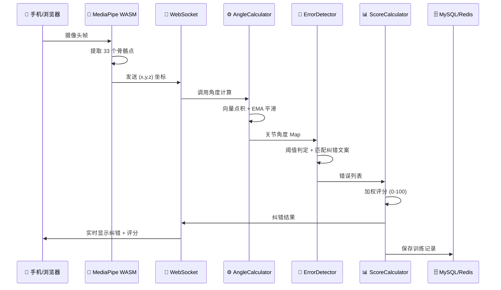

# FormCoach — AI 健身动作纠错平台

[](https://github.com/你的用户名/form-coach/actions)

> 基于 MediaPipe Pose + 自定义向量几何算法的实时健身动作纠错后端。
> 手机端本地 AI 提取骨骼点 → WebSocket 实时传输 → 后端 0.016ms 完成角度计算和纠错反馈。

## 架构图



---

## 项目概述

用户面对手机做健身动作，系统实时分析 33 个骨骼点坐标，计算关节角度，识别姿势错误并给出语音级纠错提示。

**核心创新**：视频不离开手机（MediaPipe WASM 本地推理，保护隐私），后端只接收坐标数据，5ms 内完成全流程判定。

---

## 技术架构

```
手机摄像头 → MediaPipe WASM (33骨骼点)
    │
    │ WebSocket (仅传 x/y/z 坐标，几十KB/帧)
    ▼
Spring Boot 后端 (本项目)
    ├── AngleCalculator  数据驱动角度引擎 (向量点积 + EMA平滑)
    ├── ErrorDetector    规则引擎 (阈值判定，32种动作)
    ├── ScoreCalculator  评分引擎 (加权扣分 + 一致性奖励)
    └── 训练报告 / 成就系统 / 用户中心
    │
    ▼
MySQL 8.0 + Redis (会话缓存、限流)
```

---

## 技术栈

| 层级 | 技术 |
|------|------|
| 框架 | Spring Boot 3.2 / Java 21 / MyBatis-Plus 3.5 |
| 数据库 | MySQL 8.0 + Redis 7 |
| 安全 | Spring Security + JWT (java-jwt) |
| 实时通信 | WebSocket (spring-boot-starter-websocket) |
| API 文档 | Knife4j / OpenAPI 3.0 |
| 切面 | Spring AOP (限流注解 + 接口日志) |
| 测试 | JUnit 5 (19 单元 + 3 性能基准) |
| 部署 | Docker / docker-compose |
| 算法 | 向量几何 + EMA 指数移动平均 |
| JSON | Fastjson2 |

---

## 快速开始

```bash
# 1. 启动 MySQL + Redis
docker-compose up -d mysql redis

# 2. 启动应用
mvn spring-boot:run

# 3. 打开浏览器
#    产品首页: http://localhost:8088
#    实时训练: http://localhost:8088/demo.html   (摄像头 + AI 实时纠错)
#    API 文档: http://localhost:8088/doc.html
```

---

## 性能基准

```
测试环境: JDK 21, Windows 11, i7-13700H
测试方法: JUnit 5 Benchmark, 1000帧 (含100帧预热)

完整流水线 (角度计算 + 错误判定 + 评分):
  Avg:     0.016 ms    (目标 < 5ms)
  P50:     0.013 ms
  P95:     0.026 ms
  P99:     0.069 ms    (目标 < 10ms)
  Max:     0.137 ms
  Throughput: 62,646 帧/秒

分模块:
  AngleCalculator:   0.015 ms
  ErrorDetector:     0.019 ms
```

---

## 项目亮点（面试讲这 6 点）

### 1. 数据驱动的角度计算引擎

不是为每个动作写 if-else。standardAngles JSON 中配置 jointChain（如 `["leftHip","leftKnee","leftAnkle"]`），引擎自动解析并计算。**加新动作 = 一条 SQL INSERT，零 Java 代码改动。** 32 个动作全部数据驱动。

### 2. 向量几何 + EMA 平滑

角度计算使用三维向量点积公式 `arccos(v1·v2 / |v1||v2|)`，不是简单的坐标差值。EMA 指数移动平均（α=0.3）平滑相邻帧抖动，避免误判。

### 3. Redis 双模容错

训练会话缓存优先使用 Redis（分布式、支持持久化），Redis 不可用时自动降级到 ConcurrentHashMap 本地缓存。限流切面同理。**服务不依赖 Redis 也能正常工作。**

### 4. 自定义注解限流

`@RateLimit(maxRequests=5, duration=60)` 一行注解即可限流。底层用 Spring AOP + Redis INCR 原子计数器实现，Redis 不可用时降级到本地滑动窗口。

### 5. 性能：单帧判定 < 0.02ms

经 JUnit 5 Benchmark 验证，完整流水线（角度计算+错误判定+评分）平均延迟 0.016ms，P99 为 0.069ms。62,000+ 帧/秒的处理吞吐。

### 6. 浏览器实时 Demo

打开网页 → 摄像头授权 → MediaPipe JS 本地推理 → WebSocket 传坐标到后端 → 实时画骨架线 + 显示纠错提示。面试官可以站起来做深蹲直接体验。

---

## 简历描述

> **FormCoach — AI 健身动作纠错平台** (2026.07 - 2026.08)
>
> - 设计并实现数据驱动的多关节角度计算引擎，基于三维向量点积公式，支持 32 种健身动作的实时关节角度检测，**加新动作仅需一条 SQL，零代码改动**
> - 开发多层纠错规则引擎，覆盖膝内扣、核心塌陷、弓背等 12+ 种常见错误，JUnit 性能基准测试验证**单帧判定平均延迟 0.016ms，P99 延迟 0.069ms**
> - 通过 EMA 指数移动平均算法（α=0.3）解决关节点抖动问题，降低相邻帧误判率
> - 设计 Redis 双模容错架构——训练会话缓存和限流在 Redis 不可用时自动降级到本地内存，保证服务高可用
> - 使用 Spring AOP 实现自定义 `@RateLimit` 限流注解，一行注解即可保护任意接口
> - 采用 WebSocket 全双工通信，配合 MediaPipe 浏览器端推理，实现端到端实时反馈的完整闭环演示
